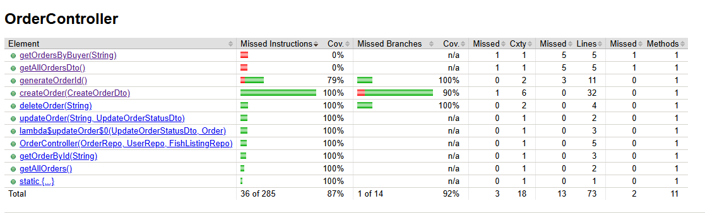

# Order Unit Test Detailed Documentation

## Overview
This document provides a comprehensive technical breakdown of the unit tests for the `OrderController`. The tests verify the correctness of the REST API endpoints for managing orders, ensuring proper data handling, validation, and error responses.

**Test Class:** `src/test/java/com/example/backend/controller/OrderControllerTest.java`
**Frameworks:** JUnit 5, Mockito
**Testing Approach:** Unit testing with `@InjectMocks` and Mockito (isolating controller logic without loading full Spring Context).

## Test Environment Setup
The test class uses `@ExtendWith(MockitoExtension.class)` to enable Mockito support. Dependencies are mocked using `@Mock` and injected into the controller using `@InjectMocks`.

### Mocks
- **`OrderRepo`**: Handles database operations for `Order` entities.
- **`UserRepo`**: Handles retrieval of `User` (Buyer) entities.
- **`FishListingRepo`**: Handles retrieval of `FishListing` entities.

### Test Data (`setUp()`)
- **Buyer**: User ID `user1`
- **Fish Listing**: ID `1L`, Price `10.00`
- **Order Item**: Fish Listing ID `1L`, Quantity `2.0`
- **Create Order DTO**: Buyer ID `user1`, containing the above item.

---

## Feature 1: Create Order
**Method:** `createOrder`

### Test Cases

| Test Method | Scenario | Input Payload | Mock Behavior | Expected Result |
| :--- | :--- | :--- | :--- | :--- |
| `testCreateOrder_Success` | **Success**: Valid data | `{"buyerId": "user1", "items": [{"fishListingId": 1, "quantity": 2.0}]}` | `userRepo` finds buyer `fishListingRepo` finds listing `orderRepo` saves order | **201 Created** JSON: `buyerId: "user1"`, `totalPrice: 20.00` |
| `testCreateOrder_BuyerNotFound` | **Error**: Buyer not found | `{"buyerId": "unknownUser", ...}` | `userRepo` returns empty | **404 Not Found** Msg: "Buyer not found" |
| `testCreateOrder_EmptyItems` | **Error**: Empty items list | `{"items": []}` | `userRepo` finds buyer | **400 Bad Request** Msg: "Order must contain at least one item." |
| `testCreateOrder_FishListingNotFound` | **Error**: Fish listing not found | `{"items": [{"fishListingId": 999}]}` | `userRepo` finds buyer `fishListingRepo` returns empty | **404 Not Found** Msg: "Fish listing with ID 999 not found" |

---

## Feature 2: Update Order
**Method:** `updateOrder`

### Test Cases

| Test Method | Scenario | Input Payload | Mock Behavior | Expected Result |
| :--- | :--- | :--- | :--- | :--- |
| `testUpdateOrder_Success` | **Success**: Update status | `{"status": "CONFIRMED"}` | `orderRepo` finds order `orderRepo` saves updated order | **200 OK** Status: `CONFIRMED` |
| `testUpdateOrder_NotFound` | **Error**: Order not found | `{"status": "CONFIRMED"}` | `orderRepo` returns empty | **404 Not Found** |

---

## Feature 3: Delete Order
**Method:** `deleteOrder`

### Test Cases

| Test Method | Scenario | Mock Behavior | Expected Result |
| :--- | :--- | :--- | :--- |
| `testDeleteOrder_Success` | **Success**: Delete existing | `orderRepo.existsById("ORD001")` returns `true` `orderRepo.deleteById(...)` called | **200 OK** Msg: "Order deleted successfully" |
| `testDeleteOrder_NotFound` | **Error**: Order not found | `orderRepo.existsById("ORD999")` returns `false` | **404 Not Found** |

---

## Feature 4: Get Orders
**Methods:** `getOrderById`, `getAllOrders`

### Test Cases

| Test Method | Endpoint/Method | Scenario | Mock Behavior | Expected Result |
| :--- | :--- | :--- | :--- | :--- |
| `testGetOrderById_Success` | `getOrderById("ORD001")` | **Success**: Found | `orderRepo` finds order | **200 OK** |
| `testGetOrderById_NotFound` | `getOrderById("ORD001")` | **Error**: Not found | `orderRepo` returns empty | **404 Not Found** |
| `testGetAllOrders` | `getAllOrders()` | **Success**: List all | `orderRepo.findAll()` returns list | **200 OK** |

---

## Test Coverage Result

The following image shows the test coverage results, indicating the percentage of code covered by these unit tests.

