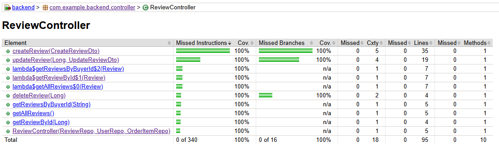
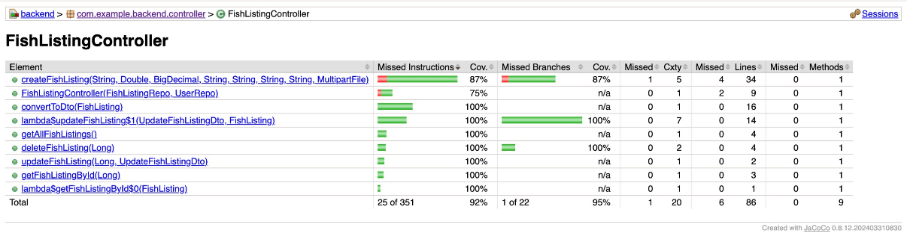

# Review Unit Test Detailed Documentation

## Overview
This document provides a comprehensive technical breakdown of the unit tests for the `ReviewController`. The tests verify the correctness of the REST API endpoints for managing reviews, ensuring proper data handling, validation, and error responses.

**Test Class:** `src/test/java/com/example/backend/controller/ReviewControllerTest.java`
**Frameworks:** JUnit 5, Mockito, Spring MockMvc

## Test Environment Setup
The test class uses `@WebMvcTest(ReviewController.class)` to isolate the controller layer. Dependencies are mocked using `@MockBean`.

### Mocks
- **`ReviewRepo`**: Handles database operations for `Review` entities.
- **`UserRepo`**: Handles retrieval of `User` (Buyer) entities.
- **`OrderItemRepo`**: Handles retrieval of `OrderItem` entities.

### Test Data (`setUp()`)
- **Buyer**: User ID `BUY0001`, Username `test_buyer`
- **Other Buyer**: User ID `BUY0002` (used for unauthorized access tests)
- **Order Item**: ID `1L`
- **Review**: ID `1L`, Rating `5`, Comment "Great product!"

---

## Feature 1: Create Review
**Endpoint:** `POST /api/reviews/create`

### Test Cases

| Test Method | Scenario | Input Payload | Mock Behavior | Expected Result |
| :--- | :--- | :--- | :--- | :--- |
| `testCreateReview_BaseChoice_Positive` | **Success**: Valid data | `{"rating": 5, "comment": "Excellent...", "buyerId": "BUY0001", "orderItemId": 1}` | `userRepo` finds buyer `orderItemRepo` finds item `reviewRepo` saves review | **201 Created** JSON: `rating: 5` |
| `testCreateReview_BaseChoice_Negative` | **Success**: Low rating | `{"rating": 1, ...}` | Same as above | **201 Created** JSON: `rating: 1` |
| `testCreateReview_Variation_InvalidBuyer` | **Error**: Buyer not found | `{"buyerId": "INVALID", ...}` | `userRepo` returns empty | **404 Not Found** Msg: "Buyer not found" |
| `testCreateReview_Variation_InvalidOrderItem` | **Error**: Item not found | `{"orderItemId": 999, ...}` | `orderItemRepo` returns empty | **404 Not Found** Msg: "Order item not found" |
| `testCreateReview_Variation_ReviewExists` | **Error**: Duplicate review | Valid payload | `reviewRepo.existsByOrderItemId(1)` returns `true` | **409 Conflict** Msg: "Review... already exists" |
| `testCreateReview_Variation_UnauthorizedBuyer` | **Error**: Wrong buyer | `{"buyerId": "BUY0002", ...}` | `userRepo` finds `otherBuyer` (not owner of order) | **403 Forbidden** Msg: "This order item does not belong..." |

---

## Feature 2: Update Review
**Endpoint:** `PUT /api/reviews/update/{id}`

### Test Cases

| Test Method | Scenario | Input Payload | Mock Behavior | Expected Result |
| :--- | :--- | :--- | :--- | :--- |
| `testUpdateReview_BaseChoice_FullUpdate` | **Success**: Update all fields | `{"rating": 4, "comment": "Updated"}` | `reviewRepo` finds review `reviewRepo` saves updated review | **200 OK** JSON: `rating: 4`, `comment: "Updated"` |
| `testUpdateReview_BaseChoice_RatingOnly` | **Success**: Update rating | `{"rating": 3}` | `reviewRepo` finds review Updates rating, keeps comment | **200 OK** JSON: `rating: 3`, `comment: "Great product!"` |
| `testUpdateReview_BaseChoice_CommentOnly` | **Success**: Update comment | `{"comment": "Just okay"}` | `reviewRepo` finds review Updates comment, keeps rating | **200 OK** JSON: `rating: 5`, `comment: "Just okay"` |
| `testUpdateReview_Variation_InvalidId` | **Error**: Review not found | `{"rating": 4}` | `reviewRepo` returns empty | **404 Not Found** Msg: "Review not found" |

---

## Feature 3: Delete Review
**Endpoint:** `DELETE /api/reviews/delete/{id}`

### Test Cases

| Test Method | Scenario | Mock Behavior | Expected Result |
| :--- | :--- | :--- | :--- |
| `testDeleteReview_BaseChoice_ValidId` | **Success**: Delete existing | `reviewRepo.existsById(1)` returns `true` `reviewRepo.deleteById(1)` called | **200 OK** Body: "Review deleted successfully" |
| `testDeleteReview_Variation_InvalidId` | **Error**: Review not found | `reviewRepo.existsById(999)` returns `false` | **404 Not Found** |

---

## Feature 4: Get Reviews
**Endpoints:**
- `GET /api/reviews/{id}`
- `GET /api/reviews/list`
- `GET /api/reviews/buyer/{buyerId}`

### Test Cases

| Test Method | Endpoint | Scenario | Mock Behavior | Expected Result |
| :--- | :--- | :--- | :--- | :--- |
| `testGetReviewById_BaseChoice_ValidId` | `/api/reviews/1` | **Success**: Found | `reviewRepo` finds review | **200 OK** JSON: `id: 1` |
| `testGetReviewById_Variation_InvalidId` | `/api/reviews/999` | **Error**: Not found | `reviewRepo` returns empty | **404 Not Found** |
| `testGetAllReviews_BaseChoice` | `/api/reviews/list` | **Success**: List all | `reviewRepo.findAll()` returns list | **200 OK** JSON: Array of reviews |
| `testGetReviewsByBuyerId_BaseChoice` | `/api/reviews/buyer/BUY0001` | **Success**: List by buyer | `reviewRepo.findByBuyerId(...)` returns list | **200 OK** JSON: Array of reviews |

---

## Test Coverage Result

The following image shows the test coverage results, indicating the percentage of code covered by these unit tests.

---

# Fish Listing Unit Test Detailed Documentation

## Overview
This document provides a comprehensive technical breakdown of the unit tests for the `FishListingController`. The tests verify the correctness of the REST API endpoints for managing fish listings in a marketplace system, ensuring proper data handling, file upload functionality, role-based validation, and appropriate error responses.

**Test Class:** `src/test/java/com/example/backend/controller/FishListingControllerTest.java`
**Frameworks:** JUnit 5, Mockito, Spring MockMvc
**Testing Strategy:** MBCC (Multiple Base Choice Coverage)

## Test Environment Setup
The test class uses `@WebMvcTest(FishListingController.class)` to isolate the controller layer for focused unit testing. Dependencies are mocked using `@MockBean` to simulate repository interactions without requiring a full application context.

### Mocks
- **`FishListingRepo`**: Handles database operations for `FishListing` entities.
- **`UserRepo`**: Handles retrieval of `User` entities to validate fisherman identity and role.

### Test Data (`setUp()`)
- **Fisherman**: User ID `FISH001`, Username `john_fisher`, Role `FISHERMAN`
- **Buyer**: User ID `BUY001`, Username `jane_buyer`, Role `BUYER` (used for unauthorized role validation)
- **Fish Listing**: ID `1L`, Fish Type "Salmon", Weight `1.0 kg`, Price `฿1500.00`, Location "Salaya", Status `AVAILABLE`, Catch Date `2025-11-24T10:10:00`

---

## Feature 1: Create Fish Listing
**Endpoint:** `POST /api/fishListings/create`

### Test Cases

| Test Method | Scenario | Input Parameters | Mock Behavior | Expected Result |
| :--- | :--- | :--- | :--- | :--- |
| `testCreateFishListing_BaseChoice_WithImage` | **Success**: Complete listing with image | `fishType: "Salmon"` `weightInKg: 1.0` `price: 1500.00` `catchDate: "2025-11-24T10:10:00"` `fishermanId: "FISH001"` `location: "Salaya"` `status: "AVAILABLE"` `image: fish.jpg (MockMultipartFile)` | `userRepo` finds fisherman with FISHERMAN role `fishListingRepo` saves listing | **201 Created** JSON: `fishType: "Salmon"`, `weightInKg: 1.0`, `price: 1500.00` |
| `testCreateFishListing_BaseChoice_WithoutImage` | **Success**: Listing without image upload | `fishType: "Tuna"` `weightInKg: 1.0` `price: 1300.00` `catchDate: "2025-11-20T10:00:00"` `location: "Bangkok"` `status: "AVAILABLE"` No image file | `userRepo` finds fisherman `fishListingRepo` saves listing with `null` photoUrl | **201 Created** JSON: `fishType: "Tuna"` `photoUrl: null` |
| `testCreateFishListing_BaseChoice_SoldStatus` | **Success**: Create with SOLD status | Same parameters as base with image `status: "SOLD"` | `userRepo` finds fisherman `fishListingRepo` saves listing | **201 Created** JSON: `status: "SOLD"` |
| `testCreateFishListing_Variation_InvalidFishermanId` | **Error**: Fisherman does not exist | `fishermanId: "INVALID"` | `userRepo` returns empty Optional | **404 Not Found** Body: "Fisherman not found" |
| `testCreateFishListing_Variation_NotFishermanRole` | **Error**: User lacks fisherman role | `fishermanId: "BUY001"` (buyer user) | `userRepo` finds user with BUYER role | **403 Forbidden** Body: "User is not a Fisherman" |
| `testCreateFishListing_Variation_InvalidStatus` | **Error**: Invalid enum status | `status: "INVALID_STATUS"` | `userRepo` finds fisherman | **400 Bad Request** Body: "Invalid status value: INVALID_STATUS" |

---

## Feature 2: Update Fish Listing
**Endpoint:** `PUT /api/fishListings/{id}`

### Test Cases

| Test Method | Scenario | Input Payload | Mock Behavior | Expected Result |
| :--- | :--- | :--- | :--- | :--- |
| `testUpdateFishListing_BaseChoice_FullUpdate` | **Success**: Update all modifiable fields | `{"fishType": "Updated Salmon", "weightInKg": 2.0, "price": 3000.00, "photoUrl": "http://localhost:8080/uploads/fish-images/updated.jpg", "catchDate": "2025-11-25T10:10:00", "status": "SOLD"}` | `fishListingRepo` finds listing by ID `fishListingRepo` saves updated listing | **200 OK** JSON: `fishType: "Updated Salmon"`, `weightInKg: 2.0`, `price: 3000.00`, `status: "SOLD"` |
| `testUpdateFishListing_BaseChoice_PriceOnly` | **Success**: Partial update (price) | `{"price": 180.00}` | `fishListingRepo` finds listing Updates only price, retains other fields | **200 OK** JSON: `price: 1800.00`, `fishType: "Salmon"` (original) |
| `testUpdateFishListing_BaseChoice_StatusOnly` | **Success**: Partial update (status) | `{"status": "SOLD"}` | `fishListingRepo` finds listing Updates only status, retains other fields | **200 OK** JSON: `status: "SOLD"`, `fishType: "Salmon"` (original) |
| `testUpdateFishListing_Variation_InvalidId` | **Error**: Listing does not exist | `{"price": 1800.00}` for ID `999` | `fishListingRepo` returns empty Optional for ID `999` | **404 Not Found** |

---

## Feature 3: Delete Fish Listing
**Endpoint:** `DELETE /api/fishListings/{id}`

### Test Cases

| Test Method | Scenario | Mock Behavior | Expected Result |
| :--- | :--- | :--- | :--- |
| `testDeleteFishListing_BaseChoice_ValidId` | **Success**: Delete existing listing | `fishListingRepo.existsById(1)` returns `true` `fishListingRepo.deleteById(1)` called | **200 OK** Body: "FishListing deleted successfully" |
| `testDeleteFishListing_Variation_InvalidId` | **Error**: Listing not found | `fishListingRepo.existsById(999)` returns `false` | **404 Not Found** |

---

## Feature 4: Get Fish Listings
**Endpoints:**
- `GET /api/fishListings/{id}`
- `GET /api/fishListings/list`

### Test Cases

| Test Method | Endpoint | Scenario | Mock Behavior | Expected Result |
| :--- | :--- | :--- | :--- | :--- |
| `testGetFishListingById_BaseChoice_ValidId` | `/api/fishListings/1` | **Success**: Retrieve by ID | `fishListingRepo` finds listing by ID | **200 OK** JSON: `id: 1`, `fishType: "Salmon"`|
| `testGetFishListingById_Variation_InvalidId` | `/api/fishListings/999` | **Error**: Listing not found | `fishListingRepo` returns empty Optional | **404 Not Found** |
| `testGetAllFishListings_BaseChoice` | `/api/fishListings/list` | **Success**: Retrieve multiple listings | `fishListingRepo.findAll()` returns list of 2 listings | **200 OK** JSON: Array with 2 items `[0].fishType: "Salmon"`, `[1].fishType: "Tuna"` |
| `testGetAllFishListings_BaseChoice_EmptyList` | `/api/fishListings/list` | **Success**: No listings available | `fishListingRepo.findAll()` returns empty list | **200 OK** JSON: Empty array `[]` |

---

## Test Coverage Result

The following image shows the test coverage results, indicating the percentage of code covered by these unit tests.

